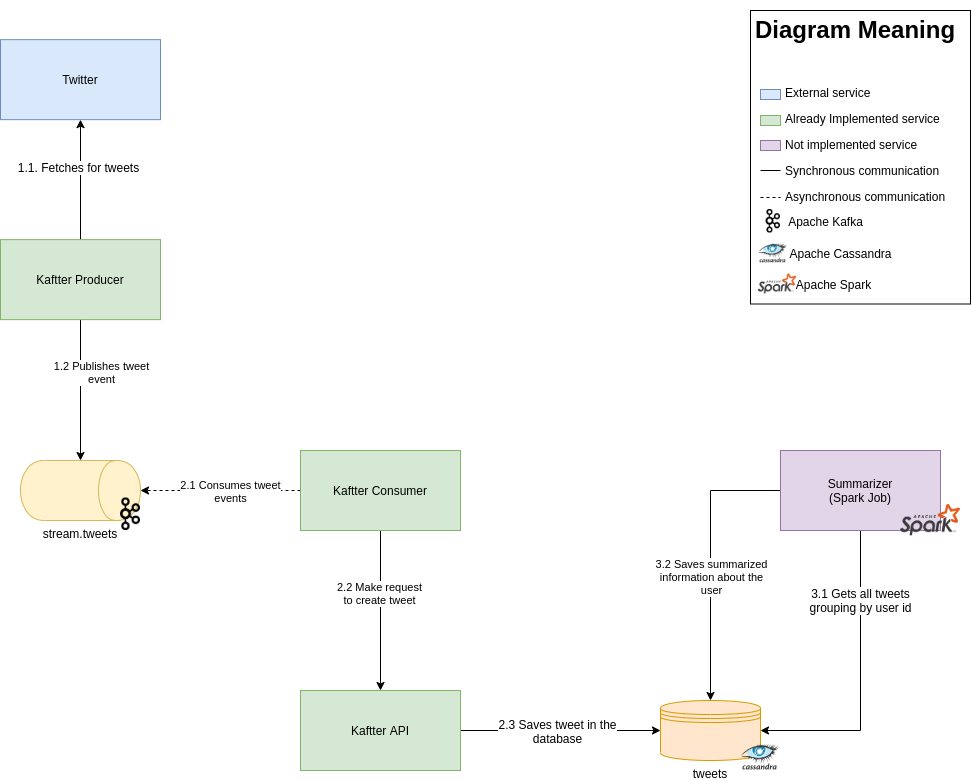

# Kaftter

[](https://travis-ci.com/3ldr0n/kaftter)

[Sonar report](https://sonarcloud.io/dashboard?id=3ldr0n_kaftter)

Takes data from Twitter and saves it in cassandra.

## Architecture



## Local environment

```bash
docker-compose up -d
```

### Kaftter producer

```bash
cd kaftter-producer
./gradlew clean build
docker build -t kaftter/kaftter-producer:1.0 .
docker run -d --name kaftter_producer kaftter/kaftter-producer:1.0
```

### Kaftter

```bash
cd kaftter
./gradlew clean build
docker build -t kaftter/kaftter:1.0 .
docker run -d --name kaftter kaftter/kaftter:1.0
```

## Endpoints

### Get tweets

```bash
GET /api/tweets/{numberOfTweets}
```

#### Response payload example

```json
[
  {
    "id": 1,
    "text": "a tweet",
    "user": {
      "id": 12,
      "name": "An Interesting Tweeter",
      "screen_name": "an_interesting_tweeter",
      "followers_count": 13
    },
    "quote_count": 2,
    "reply_count": 3,
    "retweet_count": 1,
    "favorite_count": 0,
    "lang": "en",
    "timestamp_ms": 12312983
  },
  {
    "id": 2,
    "text": "a second tweet",
    "user": {
      "id": 12,
      "name": "An Interesting Tweeter",
      "screen_name": "an_interesting_tweeter",
      "followers_count": 13
    },
    "quote_count": 0,
    "reply_count": 1,
    "retweet_count": 0,
    "favorite_count": 1,
    "lang": "en",
    "timestamp_ms": 12417820
  }
]
```

### Export tweets to csv

```bash
GET /api/tweets/export/{numberOfTweets}
```
